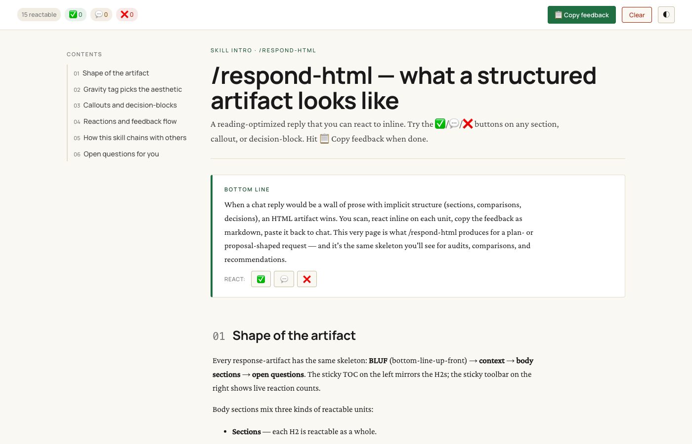

# claude-skills-shared

Nine skills for [Claude Code](https://docs.claude.com/en/docs/claude-code) — small, focused tools that change how an agent works in your terminal. Each is a single `SKILL.md` (plus supporting scripts/templates where needed) that Claude Code auto-loads when its description matches what you're asking for.



*Above: `respond-html` rendering a structured reply with reactable units. Inline ✅/💬/❌ buttons on every section/callout, live counts in the sticky toolbar, one-click copy as markdown. One of the 9 skills shipped here.*

## What's a Claude Code skill?

A skill is a markdown file with frontmatter (`name`, `description`, `user-invocable: true`) plus optional supporting files. When Claude Code starts a session it indexes every skill in `~/.claude/skills/`. When your request matches a skill's trigger phrases — or when you type the skill's slash command (e.g. `/clarify`) — Claude invokes it. From the agent's side, "invoking a skill" means loading the SKILL.md content and following its instructions.

Skills compose. One skill can chain to another by reading its file or calling its slash command. Several of the skills here chain to each other (e.g. `respond-html` calls `chrome-validate` for QA; `fresh-eyes` uses `delegate` to spawn verification subagents); the rest are standalone.

## The nine skills

### Output & QA

| Skill | Problem it solves | Standalone? |
|---|---|---|
| [`respond-html`](./respond-html/) | When a chat reply has implicit structure (plan, audit, comparison, proposal), the chat format buries it. `respond-html` writes a self-contained HTML artifact with reading-optimized layout, inline ✅/💬/❌ reactions per section/callout/decision-block, and a one-click "copy feedback as markdown" button. The user reacts in the browser, pastes the markdown back to chat, the agent iterates. | ⚠️ Chains to `chrome-validate` (bundled) for QA, `dataviz` (bundled) for data + process content, and `frontend-design` (an Anthropic plugin — see below) for UI mockups. Gracefully degrades when any of those are missing. |
| [`chrome-validate`](./chrome-validate/) | "Looks good" isn't QA. Before sending an HTML or PDF, you need evidence: actual screenshots, computed CSS values, real link liveness, PDF text-diff checks. `chrome-validate` packages six subcommands (`visual`, `css`, `layout`, `links`, `pdf`, `network`) + an `all` suite-mode that runs them sequentially, each with paste-able evidence. | ✅ Needs Chrome MCP (`claude-in-chrome` or `chrome-devtools-mcp`); `pdftotext` for the PDF subcommand. |
| [`dataviz`](./dataviz/) | Charts and process diagrams default to "a label per axis" instead of "a finding the reader can act on". `dataviz` is a 7-phase workflow: PhD-statistician EDA, signal extraction with a review gate, library pick (Observable Plot / Plotly / Vega-Lite / Chart.js / Mermaid), insight-titled rendering. Two modes: **data** (JSON/CSV → dashboard) and **process** (workflow description → annotated diagram). | ✅ Standalone for both modes; can also be invoked by `respond-html` via the Skill tool. |

### Discipline & meta-review

| Skill | Problem it solves | Standalone? |
|---|---|---|
| [`clarify`](./clarify/) | Agents make unilateral assumptions on ambiguous requests, then have to redo work when the assumption was wrong. `clarify` is a structural forcing function: when invoked, the agent MUST stop, audit the request for ambiguity / scope creep / unilateral tradeoffs / irreversible-action risk, and ask via `AskUserQuestion` before continuing. | ✅ Pure prose, no scripts. |
| [`fresh-eyes`](./fresh-eyes/) | Plans drift from reality as conversations grow. `fresh-eyes` spawns parallel verification subagents (Plan/Decision, Code Reality, Integration, Edge Case) via `delegate`, each independently auditing the plan against the actual repo state, and produces a Reality Score + verdict. Designed to be run as an iteration loop — each round produces findings → apply fixes → re-run — until 10/10. Includes a bats-tested cache + lock helper for resumable multi-round audits. | ⚠️ Needs `delegate` (bundled) for subagent fan-out; `bats-core` + `shellcheck` to run the test suite. |
| [`second-opinion`](./second-opinion/) | Single-model reviews have blind spots that two models from the same family share. `second-opinion` runs Gemini + Claude Sonnet + Claude Opus in parallel on the same artifact (file, PRD, decision, plan, proposal) and surfaces the union of their findings — three independent reviewers with different strengths. Distinct from `fresh-eyes` (which audits the in-conversation plan, not a finished artifact). | ✅ Needs a Gemini CLI for the Gemini reviewer; gracefully degrades to Claude-only if Gemini isn't available. |

### Workflow

| Skill | Problem it solves | Standalone? |
|---|---|---|
| [`delegate`](./delegate/) | Long-running or parallelizable work in a single Claude Code session crowds the main context. `delegate` spawns a child Claude session in tmux with a scoped task, registers it in a JSON file, and gives you cooperation verbs (`tell`, `fetch`, `status`, `close`) to drive it from the parent. No MCP dependency — works with any Claude Code install + tmux. | ✅ Needs `tmux`; macOS-tested, should work on Linux. |
| [`pre-send`](./pre-send/) | Behavioural "always confirm before send" rules fail in practice — agents interpret "start" as confirmation, send modified drafts without re-confirmation, fire from wakeups with no human in the loop. `pre-send` pairs a SKILL.md (the approval ritual) with a PreToolUse hook (`send-gate.sh`, bundled) that physically blocks send tools unless a fresh single-use approval flag exists. Structural enforcement of confirmation rather than behavioural. | ⚠️ Hook lives in `pre-send/hooks/send-gate.sh` and needs to be wired into your `settings.local.json` — instructions in the SKILL.md. |
| [`plan-archive`](./plan-archive/) | Architecture decisions and strategic plans get made, executed, and forgotten — no way to retrospectively check "did similar bets pay off?" `plan-archive` saves any plan to a central dated archive directory with a standard template (context, decision, alternatives, open questions, retrospective). Useful both as a manual `/plan-archive` and as an end-of-session ritual triggered by a session-close skill. | ✅ Default location is `~/.claude-plans/`, overridable via `CLAUDE_PLANS_DIR`. Auto-commits if the archive dir is a git repo. |

### `frontend-design` is an Anthropic plugin, not bundled here

`respond-html` delegates UI/component mockup requests to `frontend-design`, which ships as part of Anthropic's official plugin marketplace rather than as a personal skill. Install it from there if you want that path:

```
/plugin marketplace add anthropics/claude-plugins-official
/plugin install frontend-design@claude-plugins-official
```

Without it, `respond-html` falls back to its own reading-optimized template for everything that isn't a UI mockup — which is most cases.

## Install

Drop the four skill dirs into your Claude Code skills directory:

```bash
cd ~/.claude/skills
git clone https://github.com/davidsimoes/claude-skills-shared.git _tmp
mv _tmp/{clarify,delegate,respond-html,chrome-validate,dataviz,fresh-eyes,second-opinion,plan-archive,pre-send} .
rm -rf _tmp
```

Or, if you'd rather keep the repo elsewhere and symlink (set `REPO_PATH` to wherever you want it):

```bash
REPO_PATH=~/path/to/claude-skills-shared
git clone https://github.com/davidsimoes/claude-skills-shared.git "$REPO_PATH"
for skill in clarify delegate respond-html chrome-validate dataviz fresh-eyes second-opinion plan-archive pre-send; do
  ln -s "$REPO_PATH/$skill" ~/.claude/skills/$skill
done
```

Restart Claude Code. The skills register via their `user-invocable: true` frontmatter — no other config needed. Test with `/clarify` in a session; the agent should announce it's invoking the skill.

## Prerequisites

| Skill | Required | Optional |
|---|---|---|
| `clarify` | Nothing | — |
| `delegate` | `tmux` (new to tmux? see [`delegate/tmux-primer.md`](./delegate/tmux-primer.md)) | — |
| `chrome-validate` | Chrome MCP server (`claude-in-chrome` or the `chrome-devtools-mcp` plugin), `pdftotext` for the PDF subcommand (macOS: `brew install poppler`) | `bats-core` + `shellcheck` to run the test suite in `chrome-validate/tests/` |
| `dataviz` | A browser to open the rendered HTML | — (CDN-loaded libraries: Observable Plot, Plotly, Vega-Lite, Chart.js, Mermaid, Tabulator) |
| `respond-html` | `python3` (for the smoke-test generator) | `chrome-validate` (bundled — used as a post-render QA gate); `dataviz` (bundled — used for data + process delegation); `frontend-design` (Anthropic plugin, NOT bundled — used for UI mockup delegation, the skill works without it) |
| `fresh-eyes` | `delegate` (bundled — used for subagent fan-out) | `bats-core` + `shellcheck` to run the test suite in `fresh-eyes/tests/` |
| `second-opinion` | — | Gemini CLI (e.g. `gemini` from `@google/generative-ai-cli`) for the Gemini reviewer; without it the skill runs Claude-only and notes the degraded coverage |
| `plan-archive` | A writable directory for archived plans (default `~/.claude-plans/`, override with `CLAUDE_PLANS_DIR`) | git (auto-commits archive entries if the dir is a repo) |
| `pre-send` | Wire `pre-send/hooks/send-gate.sh` into `~/.claude/settings.local.json` as a PreToolUse hook covering your send tools (instructions in the SKILL.md) | — |

## Glossary

A few terms used in the skills that might not be obvious:

- **Skill** — a markdown file with frontmatter that Claude Code auto-loads. See [Claude Code docs](https://docs.claude.com/en/docs/claude-code/sub-agents) for the canonical reference.
- **MCP** — Model Context Protocol. The standard for tool servers in the Claude ecosystem. `claude-in-chrome`, `chrome-devtools-mcp`, and others are MCP servers.
- **Frontmatter** — the YAML block at the top of a SKILL.md (`---` delimited). `user-invocable: true` is what makes a skill callable via slash command.
- **Reactable unit** (in `respond-html`) — a section, callout, or decision-block in the rendered HTML that has its own ✅/💬/❌ button row.
- **Gravity tag** (in `respond-html`) — one of 8 tags (stern, decisive, balanced, distinctive, editorial, measured, light, multidimensional) that picks the font pair + accent for the artifact based on the content's weight.

## How the skills relate

```
  Standalone (no chain dependencies):
    ┌──────────┐  ┌─────────────┐  ┌──────────────┐  ┌──────────┐
    │ clarify  │  │  plan-arch  │  │ second-opin  │  │ pre-send │
    └──────────┘  └─────────────┘  └──────────────┘  └──────────┘

  Spawn → child:
    ┌──────────────┐         ┌────────────┐        spawns parallel
    │  fresh-eyes  │ ──uses──▶│  delegate  │        subagents in
    └──────────────┘         └────────────┘        tmux

  Output composition:
    ┌────────────┐              (Anthropic plugin,
    │  dataviz   │              install separately)
    └─────┬──────┘              ┌──────────────────┐
          │                     │ frontend-design  │
          │  delegates          └────────┬─────────┘
          │  data + process              │  delegates
          ▼                              ▼  UI mockups
    ┌─────────────────┐   ◀──────────────┘
    │  respond-html   │
    └────────┬────────┘
             │ post-render QA gate
             ▼
    ┌─────────────────┐
    │ chrome-validate │   (standalone, needs Chrome MCP)
    └─────────────────┘
```

You can install any subset. Each skill that has chain dependencies gracefully degrades when its dependencies are missing — e.g., `respond-html` without `chrome-validate` surfaces "setup gate FAIL" but the rest of the artifact still renders; `fresh-eyes` without `delegate` runs single-threaded.

## Background

These skills were extracted from a working agentic-development setup. Examples and prose in the SKILL.md files reflect that origin (mention of decks, tenders, Czech-language QA in `chrome-validate`'s PDF subcommand, etc.), but the skills themselves are domain-agnostic — they don't assume any particular workflow or industry.

If something feels too tied to the original context, that's a sanitization miss worth flagging. Open an issue or PR.

## Contributing

PRs welcome. See [CONTRIBUTING.md](./CONTRIBUTING.md) for conventions: prose style, test expectations, sanitization checklist, and how to enable the optional pre-push security scan.

## License

MIT. See [LICENSE](./LICENSE).
